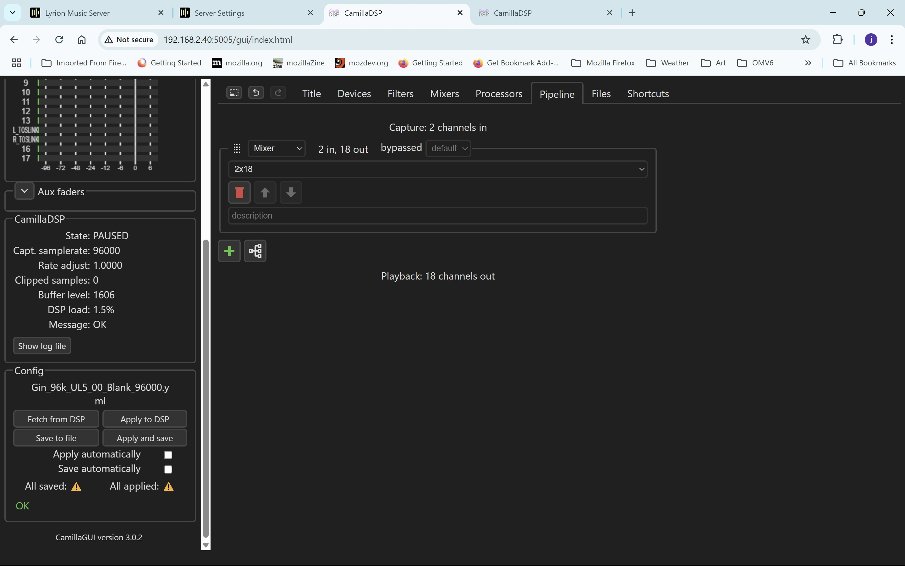

# CamillaDSP-Building-a-Config-1-Measure-Drivers-with-REW
## 1. Measure drivers with REW and use REW EQ to flatten the SPL creating Biquad (IIR) filters for each driver, then import the BIQUADs into CamillaDSP and measure the results.

### REW SPL measuring.

REW setup is detailed in https://github.com/wirrunna/CamillaDSP-Building-a-Config

First I set the SPL to about 80db. This is a K-Horn and needs to breathe. This level is also good to find various room rattles and stop them before they interfere with the measurements.

R 1_02_25 1_00 PM 2 80db Gin 96k in UL5 Blank 20-700.mdat.jpg

The red trace is the SPL and the peaks at 32Hz and 43Hz are room resonances. The peak at 140Hz is a design quirk of the folded horn. Phase will be better once the sweep goes to higher a frequency.
With REW V5.40 a right click will display the pop up panel to allow various common actions to be performed on the measurement.

This procedure is repeated for the mid and hi, altering the frequency sweep to 200-7,000 Hz for mid and 2,000 to 20,000 Hz for hi and unmuting the appropriate "destination" channel in the Mixer. In my setup with the Motu Ultralight Mk5, bass is destination 2 & 3, mid 4 & 5 and hi 6 & 7, even numbers are the Left channel, odd numbers are the Right channel. After changing the unmuted destination, don't forget to "Apply to DSP".
 

This graph shows the three drivers raw measurement at the same volume setting. The SPL difference is due to differing driver sensitivity and different amplifiers. Easy to flatten in a DSP, good luck in a passive XO.

REW V5.40 Bass Mid Hi raw.jpg

### A note about naming REW files.

First off, there will be a lot of measurement files. The file name for the Bass measurement above is R 1_02_25 1_00 PM 2 80db Gin 96k in UL5 Blank 20-700.mdat, a descriptor (rather than just an identifier) containing the measurement session date, measurement number in the session, CamillaDSP config identifier and measurement settings.  I keep an A4 note book where I write out what the measuring session is trying to achieve and the variables I am testing - new filters, different XO cut offs, rePhase Phase Fixes etc. and make a note of each measurement so that the file from REW can be related to a particular measurement session.
I have a folder called REW Measurements where I keep measurements etc filed and retrieveable.

### Calculate EQ and save EQ filters.

In REW with the Bass measurement displayed, click the EQ tab to display the EQ function screen, I usually click the "Fit to Data" box (top of screen, 4 arrows). 

First confirm that the EQ: is set to CamillaDSP at the top of the parameters. REW has CamillaDSP support builtin, up to 20 filters and correct .yaml format for direct import using the CamillaDSP GUI into the nominated config file. 

Then work down the Target Settings to set the Target Level (I normally click "Calculate target level from response").

In the Filter Tasks set the range leaving the Boost at default, and set the Flatness Target.Then click the "Match response to target" to generate the filters. 

Review the calculated filters, then click "Save filter settings to YAML file" and fill in the dialog popup where you can set the filter name for the group of filters and a second popup for the channel number in the pipeline (I usually just put 0 for the channel and change to the correct channel when building the pipeline). Again, the label is a descriptor showing the Bass measurement label and the filter task settings (Target Level, frequency spread and Flatness target) so that in later testing I can see what I was trying to do. REW will then popup a standard save file dialog to save the EQ Filters for CamillaDSP in the correct format for Biquad filters.

These screengrabs show the REW EQ screen Target Settings and Filter Tasks panels with filters calculated for the Bass measurement and the save file dialog.
Passive crossovers rarely attempt to equalise the SPL for a driver, but with an active crossover flattening the SPL is easy, as is extending the low end by reducing the output to that SPL of the lowest response. Note the "predicted" response.

REW EQ screen for Bass showing save dialog - ask for label.jpg

REW EQ screen for Bass showing save dialog - ask for channel.jpg

REW EQ screen for Bass showing save dialog - save .yaml file.jpg

Here is a partial listing of the filters generated by REW

REW generated .yaml file showing bass EQ filters.jpg

and the pipeline generated by REW

REW generated .yaml file showing bass EQ pipeline.jpg

It is these filters and the Pipeline for Bass that CamillaDSP will import to the config file in the Filters section.

### Import filters into CamillaDSP
With CamillaDSP GUI being accessed by a browser it will use the PC's file system to import filters. So, using the browser on the same PC as where REW is running makes it simple to import the filters.

In the CamillaDSP GUI I select the Config file that I want to import the filters into. I have a Config based on Michaels template for a Motu Ultralight Mk 5 (UL5) that I will use. The config only has a mixer. 

Gin_96k_UL5_Blank.jpg

Here is a screengrab showing the mixer and labels for the outputs.

UL5 Mixer showing labels.jpg

In CamillaDSP GUI select the File tab, and click the Import Config box - this screengrab shows the popup dialog with the mouse in the Import Config box, the Configs section shows the operating config with a green box around the star and the green tick indicates the config in the GUI. 

GUI Gin UL5 Blank select file import config.jpg

 Having clicked Import Config we have a choice, we can select an existing config file or by clicking the CamillaDSP Config box we get a file selection screen.

Gin UL5 Blank select file import config showing choices.jpg

Having clicked the CamillaDSP Config box, select the EQ file output by REW.

Gin UL5 Blank select config to be imported.jpg
 
and the filters and pipeline is displayed, click the button to select. Note the pipeline shows "0" which is the channel the filters will be assigned to and an "i" in a circle, hovering the mouse over the "i" will display the pipeline steps. 

Gin UL5 Blank select what to import.jpg

CamillaDSP will display a successful import screen

Gin UL5 Blank import successful.jpg
close this message and click Save to File.

After saving, the channel number should be changed. As I want these filters for left and right channels I will click the Pipeline tab and allocate the filters to the appropriate channels. 

Gin UL5 allocate filters to channels.jpg

Here is the Pipeline plot after the import showing all the EQ filters.

Gin UL5 Pipeline after Bass EQ filters imported.jpg

This process is repeated for Mid and High.
Here is a rather busy REW All SPL measurement showing RAW and EQd for each driver.

REW V5.40 Bass Mid Hi raw EQ.jpg

Here is the pipeline showing each biquad.

Gin UL5 Bass Mid Treble EQ Filters expanded.jpg

This shows the pipeline with biquads collapsed.

Gin UL5 Bass Mid Treble EQ Filters collapsed.jpg

Next is to build thecrossovers -
https://github.com/wirrunna/CamillaDSP-Building-a-Config-2-Create-Linear-Phase-XOs